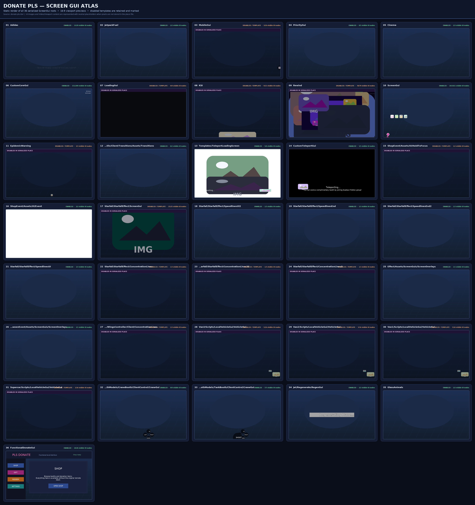

# Rate My Avatar: Korone

## Functional GUI fallback

`donate pls.rbxl` now includes **FunctionalDonateGui**, a dependency-free `ScreenGui` in `StarterGui`. It opens above the original copied UI and has working **Shop**, **Gift**, **Redeem**, and **Settings** navigation/action buttons without relying on the original game's remote/backend stack.

- Embedded client source: `src/FunctionalGui.client.lua`
- Reproducible binary-place patcher: `tools/inject_functional_gui.py`

## Screen GUI atlas

Static render of the 36 serialized `ScreenGui` roots in `donate pls.rbxl`, including the functional fallback.

